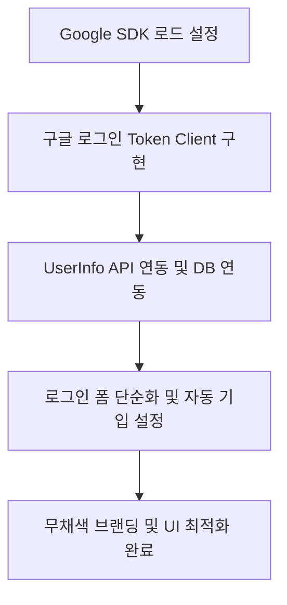

# Ya9 구글 간편 로그인 도입 및 UI 개선 요약

본 문서는 Ya9 프로젝트 내 구글 간편 로그인 기능 도입 과정과 이를 반영한 프리미엄 무채색 로그인 UI 개편의 주요 기능, 사용 기술 및 제작과정을 간결히 정리한 가이드입니다.

---

## 1. 주요 기능 (Key Features)

* **3초 초간편 소셜 로그인**: 이메일/비밀번호를 입력하는 번거로운 과정 없이 구글 계정 인증 클릭 한 번으로 가입 및 로그인 완료.
* **프로필 정보 자동 연동**: 구글 인증 성공 시 사용자의 구글 프로필 명, 프로필 이미지 주소, 이메일을 자동으로 읽어와 가입 프로필 설정 단계에 자동 사전 입력(Auto-population) 기능 제공.
* **프리미엄 무채색 미니멀 UI**: 어수선한 컬러를 배제하고 화이트/라이트 그레이/매트 블랙 조합의 현대적인 모노톤 레이아웃 적용.
* **통합 브랜딩 (Ya9)**: 기존 앱 내 혼용되던 브랜딩 명칭을 "Ya9"로 통일하여 상단 바 및 로그인 로고 텍스트에 적용.
* **동적 그래픽 로고**: 야구공 실밥과 심장박동 펄스가 결합된 원형 엠블럼 로고 디자인을 모던한 SVG 코드로 적용하여 상하 바운싱 마이크로 애니메이션 부여.

---

## 2. 사용 기능 및 연동 기술 (Tech Stack & Applied Features)

* **Google Identity Services SDK**: 구글의 최신 공식 소셜 로그인 웹 클라이언트 라이브러리(`https://accounts.google.com/gsi/client`) 연동.
* **OAuth 2.0 Token Client**: 표준 팝업 인증을 활용하는 `window.google.accounts.oauth2.initTokenClient` 기반 프로그래밍 제어 방식 사용.
* **Google UserInfo API**: 인증 응답으로 전달받은 Access Token을 헤더(Authorization Bearer)에 담아 구글 사용자 정보 엔드포인트(`https://www.googleapis.com/oauth2/v3/userinfo`)로 비동기(Fetch) 조회.
* **React State & Local Mock DB**: 로컬 스토리지 데이터 레이어(`mockDbService`)에 가져온 프로필을 매핑하고, React `useState`/`useEffect`를 이용해 화면 전환(`onNext`) 및 초기값 자동 셋팅 처리.
* **Vanilla CSS (Achromatic Theme)**: 모노톤 테마 스타일링, 반응형 카드 컨테이너 배치, 미세 인터랙션(Hover Lift 및 그림자 효과) 설정.

---

## 3. 제작 과정 (Development Process)

1. **SDK 스크립트 동적 연동**:
   * [index.html](file:///c:/Users/kimji/OneDrive/Desktop/Ya9/index.html) 내 공식 구글 GIS SDK 스크립트 태그를 헤드 영역에 추가하여 글로벌 `window.google` 환경 구성.
2. **구글 토큰 클라이언트 연동 및 콜백 설계**:
   * [LoginStep.jsx](file:///c:/Users/kimji/OneDrive/Desktop/Ya9/src/components/LoginStep.jsx) 컴포넌트 마운트 시 `initTokenClient`를 호출하여 클라이언트 인스턴스 생성.
   * 사용자가 커스텀 구글 버튼을 클릭할 때 팝업창을 띄우고, 승인 후 반환된 토큰을 받아 Google UserInfo API를 페치(Fetch)하여 유저 데이터를 실시간 획득.
3. **입력 폼 제거 및 화면 단순화**:
   * 불필요해진 이메일/패스워드 입력 폼 및 다음 단계를 과감히 제거하고 간편 로그인 전용으로 로그인 화면을 미니멀하게 설계.
4. **프로필 설정 화면 연동**:
   * [ProfileStep.jsx](file:///c:/Users/kimji/OneDrive/Desktop/Ya9/src/components/ProfileStep.jsx)에서 `mockDbService`를 읽어와 로그인한 사용자의 구글 정보(이름, 이메일, 아바타 이미지)가 디폴트로 표시되도록 폼 초기 상태 수정.
5. **무채색 브랜딩 및 프리미엄 스타일 고도화**:
   * 사용자 피드백을 반영해 로고 컬러를 매트 블랙(#111111)으로 변경.
   * 로고 왼쪽에 고급스러운 가로 구분 액센트 바(`title-left-accent`)와 "Ya9" 폰트를 적용하고, 배경색을 부드러운 단색 연회색(#f7f7f8)으로 정돈하여 전체적인 완성도 극대화.
