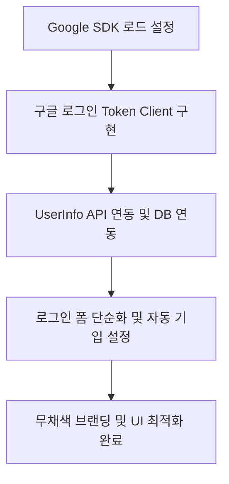

# Ya9 서비스 주요 기능 및 구글 로그인 연동/제작 요약

본 문서는 KBO 야구팬을 위한 경기장 맞춤 추천 및 소셜 커뮤니티 플랫폼인 **Ya9**의 핵심 서비스 기능과 이번에 구현된 **구글 간편 로그인 및 UI 개선 사항/제작과정**을 일목요연하게 정리한 가이드입니다.

---

## 1. Ya9 서비스 주요 기능 (Ya9 Core Features)

Ya9은 직관 야구팬들의 관람 목적에 맞춤화된 정보와 현장에서의 실시간 소통 환경을 구성합니다.

### 1) 온보딩 및 응원 구단 테마 연동 (Onboarding & Custom Theme)
* **간편 프로필 설정**: 사용자 닉네임, 아바타 이미지, 한 줄 소개글 설정.
* **마이팀(응원구단) 선택**: KBO 10개 구단 중 본인의 팀을 지정하면, 앱 전체의 시그니처 색상이 응원 구단 브랜드 컬러로 동적 테마 교체(CSS Variables 연동).

### 2) 구장 선택 및 방문 목적 분기 (Stadium & Type Selection)
* **전국 9개 KBO 구장 매핑**: 사직, 잠실, 고척 등 방문 예정인 구장을 원정/홈 조건에 따라 간편하게 지정.
* **유형별 추천 코스(응원형 vs 먹방형)**:
  * **응원형(Cheering)**: 구장 좌석 배치도 제공, 공식 티켓팅 페이지 연동 및 경기 시점별 응원 일정 타임라인 제공.
  * **먹방형(Food)**: 구장 내부 입점 먹거리와 외부 유명 맛집 리스트 제공 및 경기 전/중/후 맛집 탐방 최적 코스 추천.

### 3) 팬 중심 소셜 커뮤니티 (Community & Social Features)
* **지도 기반 실시간 핑(Ping) 공유**: 카카오맵 API를 연동하여 경기장 주변 맛집 대기 줄 현황, 주차 상황, 잔여 굿즈 등 유용한 현장 꿀팁을 실시간 위치에 핑으로 등록하고 공유.
* **실시간 커뮤니티 피드**: 야구장 인근 유저들이 남기는 피드를 타임라인 형태로 탐색 및 소통.
* **1:1 메시지 (DM) 채팅**: 직관 동행을 구하거나 구단 굿즈 교환 등을 위해 팬들끼리 실시간 대화방 개설 및 메시지 교환.

---

## 2. 구글 간편 로그인 도입 사항 (Google Login Integration)

* **3초 소셜 간편 인증**: 복잡한 입력창 없이 구글 OAuth 팝업창을 호출해 빠르게 로그인을 마칩니다.
* **가입 폼 정보 자동 기입 (Auto-population)**: 구글 사용자 정보 API를 조회하여 획득한 닉네임, 아바타 이미지를 가입 프로필 폼 필드에 자동으로 사전 대입해 편의성 제고.
* **레이아웃 유지**: 이메일/비밀번호 찾기, 직접 입력 폼 등 기존 사용 방식의 직관적인 로그인 인터페이스 틀을 유지하되, 하단 소셜 로그인 영역에 구글 간편 로그인 기능 연동.
* **통합 브랜드 네이밍**: 앱의 브랜드명을 **"Ya9"**로 일원화하고 모든 헤더 상단 로고 영역에 일괄 반영.

---

## 3. 사용 기술 및 라이브러리 (Tech Stack)

* **React 19 / Vite**: 리액트 기반의 고성능 싱글 페이지 모바일 웹 뷰 렌더링.
* **Google Identity Services SDK (OAuth 2.0)**: 구글 공식 소셜 인증 클라이언트 SDK.
* **Google UserInfo API**: Access Token 기반으로 유저 이름 및 아바타 정보를 페치하기 위한 RESTful API.
* **Kakao Map API**: 커뮤니티 탭 내 실시간 위치 핑 기능 구현.
* **Vanilla CSS / CSS Variables**: 구단별 동적 브랜드 컬러 다크모드/테마 연동 및 반응형 모바일 최적화 레이아웃.

---

## 4. 간편 로그인 제작 과정 (Development Process)

1. **글로벌 SDK 스크립트 연결**:
   * [index.html](file:///c:/Users/kimji/OneDrive/Desktop/Ya9/index.html) 헤드 영역에 구글 로그인 공식 라이브러리 비동기 로딩 태그 주입.
2. **토큰 방식 구글 클라이언트 초기화**:
   * [LoginStep.jsx](file:///c:/Users/kimji/OneDrive/Desktop/Ya9/src/components/LoginStep.jsx) 내에 `oauth2.initTokenClient` API를 연동하여 로그인 버튼 클릭 시 동적으로 팝업 요청을 발생시키도록 개발.
3. **사용자 정보 연동 및 저장**:
   * 구글 인증 결과로 받은 Access Token을 이용하여 Google UserInfo API를 호출해 사용자 정보(이름, 사진 등)를 받아오고 `mockDbService`에 안전하게 캐싱 처리.
4. **프로필 설정 화면 연동**:
   * [ProfileStep.jsx](file:///c:/Users/kimji/OneDrive/Desktop/Ya9/src/components/ProfileStep.jsx)에서 `mockDbService.getUserProfile()` 정보를 자동으로 가져와 디폴트 값으로 바인딩.
5. **브랜딩 통일 작업**:
   * 앱 상단 탑바 로고 명칭을 `stadium pulse`에서 `Ya9`로 전면 교체하여 일체감 형성.
